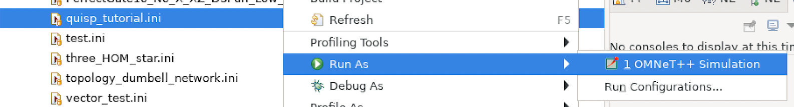
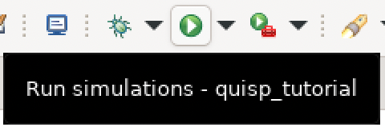
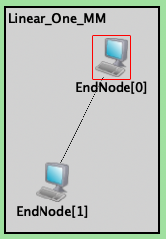
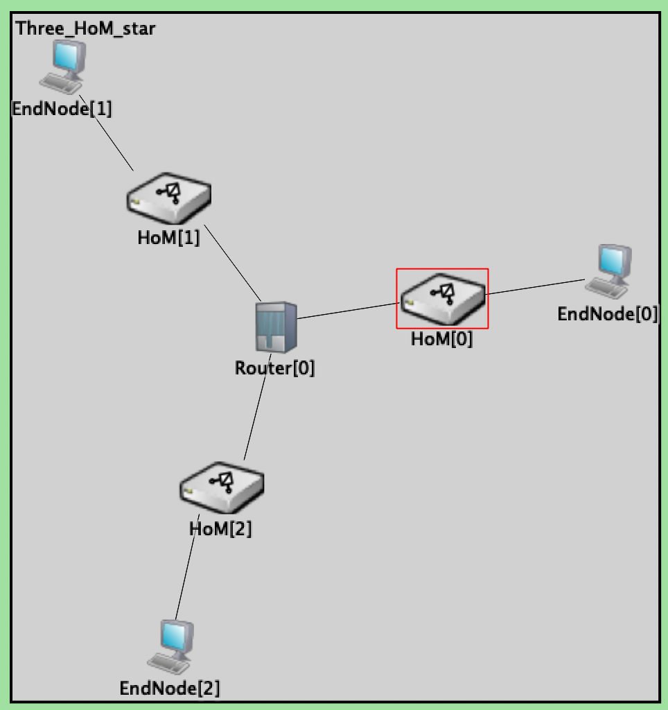
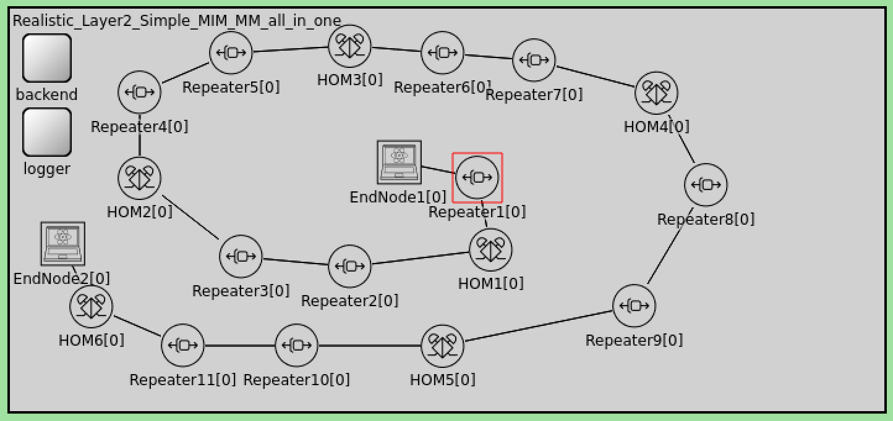

# Building your first Quantum Network

Now that you have QuISP up and running, it's time to build your first quantum network simulation. Let's open up QuISP and take a look at the simulations available to us.

## Initialization

### Selecting our simulation
- quisp_tutorial.ini

In our project explorer (default left hand side), expand the quisp master folder to see a dropdown list of folders related to QuISP. Select and expand the `/simulations` folder.

Once inside, we can see a variety of simulations we can choose to run. In this case, we will want to run the "quisp_tutorial" simulation. Do this by right clicking `quisp_tutorial.ini > Run As > OMNet++ Simulation`

> OMNet++ will now start building our QuISP simulation!

Alternatively, simply select `quisp_tutorial.ini` and click the green "Run Simulations" button in the taskbar located at the top of OMNet++.

### Choosing our network demo

After our simulation is started, the program will ask us to choose what kind of network we wish to simulate.

There are six basic types of network demos available:

- **Tutorial_MM** (Two nodes connected via a single Memory-to-Memory Link)

- **Tutorial_MIM** (Two nodes connected via a single Memory-Interface-Memory link)   "HoM" is a Bell State Analyzer in the middle of the link

- **Three_HOM_Star** (Star topology with 3 links with "HoM" in the middle of each link)

- **Realistic_Layer2_Simple_MIM_MM_all_in_one** (A moderately realistic network made up of MIM and MM connections, with repeaters to extend the signal)

- **Realistic_Layer2_Star_Sep** (A moderately realistic network with a star topology)

- **Tutorial_Big_Q_Network** (A large quantum network consisting of various nodes)

### Initializing our Parameters

After the desired network demo is selected from the drop-down menu, the simulator will ask you to set some parameters. 

Additional parameters can be set in the .ini and .ned files but for now in these demo simulations, you will just be asked to set five main parameters:

- **log file name** 
- **number of bell pairs**
- **link tomography**
- **initial purification**
- **purification type**

When selecting these parameters, be sure to check the "Use this value for all similar parameters" box to set these parameters for all nodes in our network.

Congratulations on building your first network simulation in quisp! Once completed, your network simulation should be up and running. Now you are ready to take a look at the various other network simulations available to us within QuISP!
