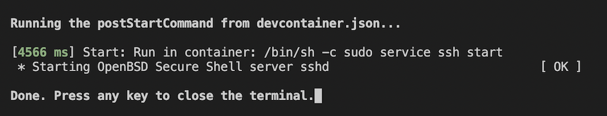

# Setting up the Visual Studio Code Environment

Visual Studio Code is the editor of choice for many people (and most of our team members also use it), so we decided to make a guide on how to setup your workspace so you can get the most functionality out of VSCode (e.g. code formatting, linting, intellisense, etc) and developing QuISP is smooth as possible.

## Prerequisites

1. Installed docker and docker desktop (for MacOS and Windows)

## Setup Dev Container

The Dev Containers extension lets you use a Docker container as a full-featured development environment.
Since we recommend using a docker container as the development environment, we have provided a tutorial for the VSCode setup using Dev Container.

1. Open quisp (not quisp/quisp) in VSCode.
2. Choose View –> Extensions, then search for “Dev Containers” and install it.
3. From the command palette (keyboard shortcut: command shift p in macOS), select Dev Containers: Rebuild and Reopen in Container
4. Pull up the terminal inside your VSCode by dragging from the blue bar at the bottom. If the VSCode terminal of the new window looks something like this, you have successfully set up the dev container.



If you encounter errors when building the dev container, update docker and docker desktop and try step 3 again.

## Setup clangd

clangd provides C/C++ completion, navigation, and insights.
We recommend using clangd since it has VSCode integration via official extension. This will enable us to format code according to .clang-format file and lint and give hints according to rules defined in .clang-tidy file.

1. **Disable official C/C++ extension from Microsoft**  
When you start the dev container, the official C/C++ extension from Microsoft is not installed.
To make sure, choose View –> Extensions and check if the C/C++ extension from Microsoft is uninstalled or disabled. This extension may have weird and unprecedented interactions with the clangd extension.
2. **Install clangd VSCode Extension**  
Once you have confirmed that the C/C++ extension from Microsoft is disabled or not installed. Choose View –> Extensions, then search for “clangd” and install it.
3. **Install clangd language server**  
By default, the dev container does not have the clangd language server installed. When you install the “clangd” VSCode extension, you will be prompted to download clangd.
If you are not prompted to download clangd, you need to install it manually. Execute the following code in the VSCode terminal.

    ```bash
    sudo apt update -y
    sudo apt-get install clangd-12
    sudo update-alternatives --install /usr/bin/clangd clangd /usr/bin/clangd-12 100
    ```

    At this point, clangd should still show a lot of errors, such as "omnetpp.h not found".

4. **Generate the compilation database compiled_command.json**  
We need to make a clean build of QuISP. At project root directory (quisp),
`$ make distclean; bear -- make run-unit-test`
clangd relies on compiled_command.json to support code completion. compiled_command.json contains the compiling information of the project.
5. **Confirm that compiled_command.json was created successfully**  
The file should contain something like the snippets below. It will create one compile arguments for each file as one json object in the array.

    ```json
    [
      {
        "arguments": [
          "/usr/local/Cellar/llvm/12.0.0/bin/clang-12",
          "-c",
          "-std=c++14",
          "-O3",
          "-DNDEBUG=1",
          "-isystem",
          "/Users/aqua/projects/omnetpp-5.6.2/tools/macosx/include",
          "-Wno-deprecated-register",
          "-Wno-unused-function",
          "-fno-omit-frame-pointer",
          "-DWITH_MPI",
          "-DXMLPARSER=libxml",
          "-DPREFER_QTENV",
          "-DWITH_QTENV",
          "-DWITH_PARSIM",
          "-DWITH_NETBUILDER",
          "-DWITH_OSG",
          "-DWITH_OSGEARTH",
          "-I.",
          "-I/usr/local/Cellar/eigen/3.3.9/include/eigen3",
          "-I/Users/aqua/projects/omnetpp-5.6.2/include",
          "-o",
          "out/clang-release//channels/QuantumChannel.o",
          "channels/QuantumChannel.cc"
        ],
        "directory": "/Users/aqua/projects/quisp/quisp",
        "file": "/Users/aqua/projects/quisp/quisp/channels/QuantumChannel.cc",
        "output": "/Users/aqua/projects/quisp/quisp/out/clang-release//channels/QuantumChannel.o"
      },
      ...
    ]
    ```

Done! Navigate to code file in QuISP (e.g. QuantumChannel.cc), and you should see that all the errors are now gone.

## Reference

Dev Containers v0.275.1
clangd v0.1.23
